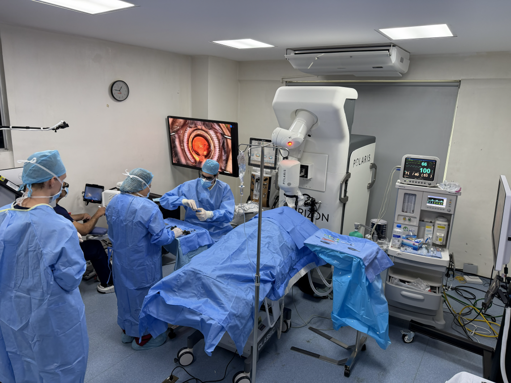
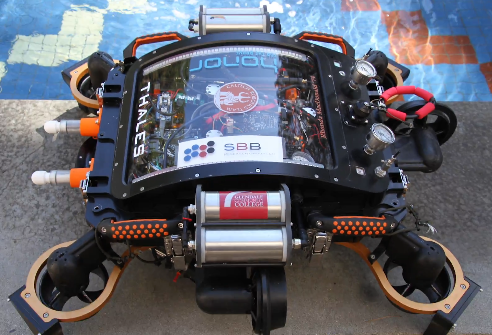

# Portfolio

## 2025
World's first robot-assisted cataract surgery with Horizon Surgical Systems.

## 2016
First place at RoboSub, an international student competition for autonomous submarines, with the Caltech Robotics Team.

## Acknowledgements
- An, Y., Mitchell, D., Lathrop, J., Flynn, D., & Chung, S. J. (2024, November). Motor Imagery Teleoperation of a Mobile Robot Using a Low-Cost Brain-Computer Interface for Multi-Day Validation. In 2024 IEEE Conference on Telepresence (pp. 103-110). IEEE.
- Kim, K., Rahili, S., Shi, X., Chung, S. J., & Gharib, M. (2019). Controllability and design of unmanned multirotor aircraft robust to rotor failure. In AIAA Scitech 2019 Forum (p. 1787).
- Bayard, D. S., Conway, D. T., Brockers, R., Delaune, J. H., Matthies, L. H., Grip, H. F., ... & San Martin, A. M. (2019). Vision-based navigation for the NASA mars helicopter. In AIAA Scitech 2019 Forum (p. 1411).
- Khalid Jawed, M., Huang, X., Batzorig, A., & Majidi, C. (2018). Computational tools for data-driven design of soft robots. In APS March Meeting Abstracts (Vol. 2018, pp. F54-011).
- Huang, X., Khalid Jawed, M., Batzorig, A., & Majidi, C. (2018). A Versatile and Robust Soft Rolling Robot Driven by Shape Memory Alloy. In APS March Meeting Abstracts (Vol. 2018, pp. H47-013).
